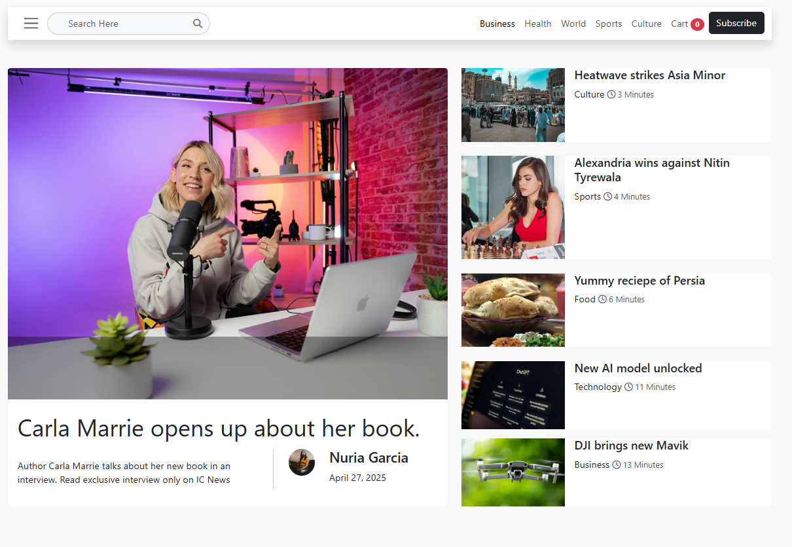

# 📰 IC-News - A Responsive News Website Template

[](https://developer.mozilla.org/en-US/docs/Web/HTML)
[](https://developer.mozilla.org/en-US/docs/Web/CSS)
[](https://getbootstrap.com/)
[](https://www.javascript.com/)
[](https://greensock.com/)

<p align="center">
  
  <br>
  A sleek and dynamic news website template built with modern web technologies.
</p>

## ✨ Overview

**IC-News** is a fully responsive website template designed for showcasing news articles, blog posts, and other journalistic content. Built with a combination of **HTML5**, **CSS3**, the powerful **Bootstrap** framework, dynamic **JavaScript**, and smooth animations powered by **GSAP (GreenSock Animation Platform)**, this template offers a clean, engaging, and user-friendly experience across various devices.

This project was created as an assignment for the **Interactive Cares Complete Career Path Batch 04**. It demonstrates the application of fundamental web development skills to build a practical and visually appealing website.

## 🚀 Features

- **Fully Responsive Layout:** Adapts seamlessly to different screen sizes (desktops, tablets, and mobile devices) thanks to Bootstrap's grid system.
- **Clean and Modern Design:** Features a contemporary aesthetic that prioritizes readability and user engagement.
- **Dynamic Elements:** Incorporates JavaScript for interactive features and enhanced user experience.
- **Smooth Animations:** Leverages GSAP for subtle yet impactful animations that add visual flair and improve transitions.
- **Well-Structured HTML:** Semantic HTML5 is used for better SEO and accessibility.
- **Organized CSS:** Styles are well-structured and easy to customize.
- **Bootstrap Components:** Utilizes various Bootstrap components for a consistent and efficient development process.
- **Easy to Customize:** The template is designed to be easily adaptable to different branding and content requirements.

## 🛠️ Technologies Used

- **HTML5:** The structural foundation of the website.
- **CSS3:** Styling and layout of the website.
- **Bootstrap:** A powerful CSS framework for responsive design and pre-built components.
- **JavaScript:** Adds interactivity and dynamic functionality.
- **GSAP (GreenSock Animation Platform):** A robust JavaScript library for creating high-performance animations.

## 📂 File Structure

```
ICMag/
├── asset/              # Assets like CSS, images, and JS
│   ├── css/
│   │   └── style.css   # Custom CSS styles
│   ├── images/         # Images used in the template
│   │   ├── ...
│   └── js/
│       └── app.js      # Custom JavaScript functionality
├── vendor/             # Libraries and frameworks
│   └── bootstrap/      # Bootstrap files
│       ├── css/
│       └── js/
│   └── fontawesome/    # Font Awesome files (likely)
│       ├── css/
│       ├── js/
│       └── ...
├── .gitignore
├── index.html          # The main homepage of the news website
├── LICENSE
└── README.md           # This file
```

## ⚙️ Usage

1.  **Clone the repository** (if you have it hosted on GitHub):

    ```bash
    git clone <repository-url>
    cd ICNEWS
    ```

2.  **Open `index.html`** in your web browser to view the template.

3.  **Customize the content:**

    - Modify the HTML files (`index.html`, etc.) to add your news articles, headings, and other content.
    - Edit the CSS file (`asset/css/style.css`) to change the visual appearance, colors, fonts, and layout.
    - Implement any specific JavaScript functionality you need in (`asset/js/app.js`).

4.  **Integrate your own images and assets** by placing them in the `img/` folder or updating the file paths in the HTML and CSS.

👏 Acknowledgements

- **Bootstrap:** For providing a robust ad responsive CSS framework. (https://getbootstrap.com/)
- **GSAP (GreenSock Animation Platform):** For the powerful and smooth animation capabilities. (https://gsap.com/)
- **Interactive Cares:** For providing the learning opportunity and guidance through the Complete Career Path Batch 04. (https://www.interactivecares.com/)

🎓 Created By

This website template was created by **Mahadi Hasan** [GitHub: @mahadihk] as an assignment for the Interactive Cares Complete Career Path Batch 04.

📄 License

MIT License

Copyright (c) 2025 Mahadi Hasan

Permission is hereby granted, free of charge, to any person obtaining a copy
of this software and associated documentation files (the "Software"), to deal
in the Software without restriction, including without limitation the rights
to use, copy, modify, merge, publish, distribute, sublicense, and/or sell
copies of the Software, and to permit persons to whom the Software is
furnished to do so, subject to the following conditions:

The above copyright notice and this permission notice shall be included in all
copies or substantial portions of the Software.

THE SOFTWARE IS PROVIDED "AS IS", WITHOUT WARRANTY OF ANY KIND, EXPRESS OR
IMPLIED, INCLUDING BUT NOT LIMITED TO THE WARRANTIES OF MERCHANTABILITY,
FITNESS FOR A PARTICULAR PURPOSE AND NONINFRINGEMENT. IN NO EVENT SHALL THE
AUTHORS OR COPYRIGHT HOLDERS BE LIABLE FOR ANY CLAIM, DAMAGES OR OTHER
LIABILITY, WHETHER IN AN ACTION OF CONTRACT, TORT OR OTHERWISE, ARISING FROM,
OUT OF OR IN CONNECTION WITH THE SOFTWARE OR THE USE OR OTHER DEALINGS IN THE
SOFTWARE.
